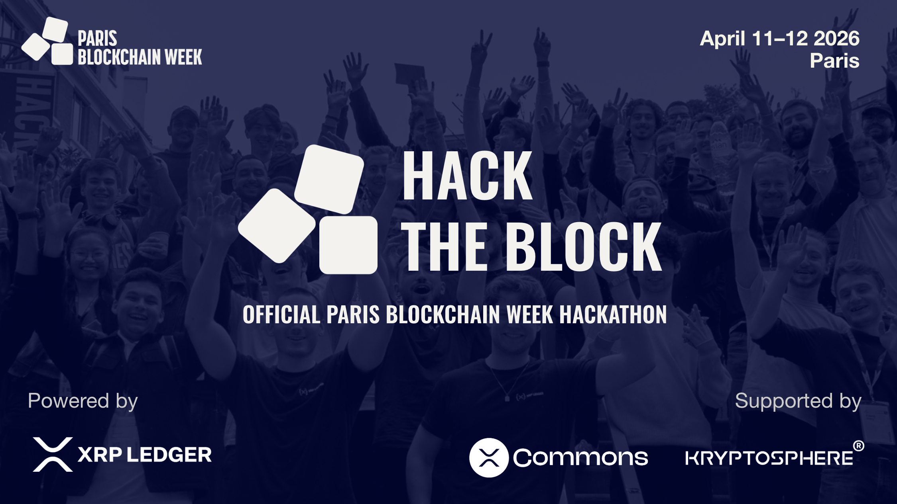

# Hack the Block 2026

### Official Paris Blockchain Week Hackathon

**April 11-12, 2026 -- Paris**

**Powered by XRP Ledger | Supported by XRPL Commons & Kryptosphere**

**Welcome to Hack the Block, the flagship hackathon of Paris Blockchain Week!**

100+ developers from around the world will have the opportunity to turn their ideas into real blockchain solutions over 24 hours of hacking.

**[Register to Hack](https://luma.com/hacktheblock2026-pbw-xrpl)** | **[Hackathon Presentation Page](https://www.parisblockchainweek.com/hackathon)**

---

### Venue

**La Faïencerie** -- Headquarters of Albert School's Paris campus
18 rue de Paradis, 75010 Paris

- Capacity up to 150 people
- Open overnight from Saturday to Sunday

---

### Tracks

#### 1. Make Waves
Build on XRPL to create applications that drive real usage, sustainable TVL, and ecosystem growth.
Use cases like micropayments, gaming, ad-tech, X402, and AI-to-AI are just examples -- the goal is to bring users, liquidity, and measurable on-chain value to XRPL.

#### 2. Impact Finance
Put blockchain at the service of social and environmental impact, fight climate change, democratize access to finance for the most excluded populations, and ensure that this technology benefits the common good above all.

#### 3. Secret
This track is still secret and will be announced on the day of the hackathon!

---

### Prizes

| Prize | Amount |
|-------|--------|
| 1st Place | 2,500 EUR |
| 2nd Place | 1,500 EUR |
| 3rd Place | 1,000 EUR |
| Secret Prize | 1,000 EUR |
| Special Prize (x2) | 1,000 EUR each |

**Total prize pool: 10,000 EUR**

---

### Agenda

#### Saturday, April 11

| Time | Event |
|------|-------|
| 08:30 - 09:00 | Doors open & Breakfast |
| 09:00 - 09:15 | Welcome Speeches |
| 09:15 - 10:00 | Team Constitution |
| 10:00 | **Let's Hack!** - Official start. Team workspace setup |
| 10:30 - 11:30 | Dive into the XRP Ledger Universe (Workshop) |
| 01:00 - 02:00 | Lunch break |
| 04:00 - 05:00 | Hack the Mentor (Office hours) |
| 07:00 - 08:00 | Dinner break |
| 10:00 - 10:30 PM | Wake-Up! (Hacker activity) |
| 10:30 PM | Overnight Coding Fun |

#### Sunday, April 12

| Time | Event |
|------|-------|
| 08:30 - 10:00 | Coffee & Breakfast |
| 11:00 - 11:30 | Hack the Mentor (Office hours) |
| 01:00 | **Final Project Submission** |
| 01:00 - 02:00 | Lunch break |
| 02:00 - 04:30 | Team Pitches |
| 04:30 - 05:30 | Jury deliberation |
| 05:30 - 06:00 | Winner Ceremony |
| 06:00 - 07:00 | Cocktail |
| 08:00 | Closing |

---

### Submission requirements

- A link to your repository, which must be publicly accessible.

- A short text presenting the main idea of your project: what it is about, what its objective is, and addressing the following questions:

> What real-world problem does your project aim to solve? Why is it important?

> How can your solution scale beyond the hackathon? Does it have the potential for broader adoption?

> Specify the XRPL features used. Does your project effectively leverage XRPL's blockchain capabilities?

> Estimate the potential volume of real-world transactions your solution could generate on the XRPL.

- A link to a video or screenshots showcasing your solution.

#### XRPL Network Requirements
- Build on the XRPL Testnet.
- All projects must submit transactions to the L1.
- Using a sidechain such as [Xahau](https://xahau.network/) or the [XRPL EVM Sidechain](https://docs.xrplevm.org/) is allowed.

#### **Final submission deadline: Sunday, April 12 at 1:00 PM**

#### **You need to prepare a 5 minute pitch followed by a 2 minute Q&A session.**

---

### Judging criteria

Project evaluation will be based on four main criteria, each carrying equal weight in the final score:

- **Idea** (the originality of the concept)
- **Implementation** (the quality of the code and robustness of the architecture)
- **Demo** (how clearly you present your solution to the user)
- **Potential** (the total value transacted on-chain, the business model, and the potential to turn your project into a product)

---

### Judges

- Denis Angell (XRPL Labs) *Technology*
- Melanie Dinane (42 Paris) *Business*
- Eva Mirza (Ledger) *Technology*
- Sylvain Verron (EM Lyon / ESDES) *Business*
- Martino Bettucci *Technology*
- Mark-Killian Zinenberg (Kryptosphere) *Technology*
- Germain Gaschet (Sharpstone Capital) *Business*
- Andrew "Handy Andy" Spencer *Technology*
- Panos (TBD) *Technology*
- David Bchiri (XRPL Commons) *Technology and business*

### Mentors

- Ray Fuentes *Technology*
- Shane Calder (132 ENG Inc) *Technology*
- Atharava Lele (Trinity College Dublin) *Technology*
- Denis Angell (XRPL Labs) *Technology*
- Andrew "Handy Andy" Spencer *Technology*
- Panos (TBD) *Technology and business*
- Luc (XRPL Commons) *Technology and business*
- Thomas (XRPL Commons) *Technology*
- Mathis (XRPL Commons) *Technology*
- Florian (XRPL Commons) *Technology*

---

### Documentation and essential links

#### Slides

[Hack the Block Opening Ceremony](./pdf/TODO)

[Hack the Block Workshop](./pdf/TODO)

#### Wifi password

Network name: `TBD`

Password: `TBD`

#### Getting started

|  |  |  |
|--|--|--|
| **XRPL Commons Products** | Starter tools, templates, and developer resources | [products.xrpl-commons.org](https://products.xrpl-commons.org) |
| **create-xrp** | CLI tool to scaffold a new XRPL project | `npx create-xrp` |

#### Documentation

|  |  |  |
|--|--|--|
| **Hackathon Ideas** | Project suggestions to get inspired for hackathons | [XRPL Hackathon Idea List](https://github.com/XRPL-Commons/community-ideas/blob/main/hackathon/index.md) |
| **Quick Start Activities** | Guided coding activities for hands-on learning | [XRPL Commons Tutorials](https://docs.xrpl-commons.org) |
| **Transaction Quick Reference** | All XRPL transactions and payloads | [XRPL transaction types](https://xrpl.org/docs/references/protocol/transactions/types) |
| **Faucets to get XRP and RLUSD** | Fund test wallets with XRP and RLUSD | [XRP Faucets](https://xrpl.org/resources/dev-tools/xrp-faucets) [RLUSD Faucets](https://tryrlusd.com/) |
| **YouTube Tutorials** | Video guides for beginners and developers | [XRPL Commons YouTube Channel](https://www.youtube.com/channel/UCwlHiotQWku7DztcnH3zrzw) |
| **Official Docs** | Main reference for everything XRPL | [XRPL Documentation](https://xrpl.org) |
| **Learn the Basics** | Interactive platform to explore XRPL fundamentals | [XRPL Learn Platform](https://learn.xrpl.org) |
| **Ripple USD Stablecoin Docs** | Reference and documentation of Ripple USD Stablecoin | [Ripple USD Stablecoin Docs](https://docs.ripple.com/stablecoin/) |
| **XRPL Explorer** | Explore accounts, transactions, and ledgers on XRPL | [XRPL Explorer](https://livenet.xrpl.org)  [XRPLWin Explorer](https://xrplwin.com/) |
| **Wallets, Escrows, Tickets** | Practical tutorials on creating wallets, trustlines, escrows and tickets | [Florian Uzio Guides](https://github.com/florent-uzio/xrpl-commons-tutorials) |

---

**[Register to Hack](https://luma.com/hacktheblock2026-pbw-xrpl)** | **[parisblockchainweek.com/hackathon](https://www.parisblockchainweek.com/hackathon)** | **[xrpl-commons.org](https://xrpl-commons.org)**

